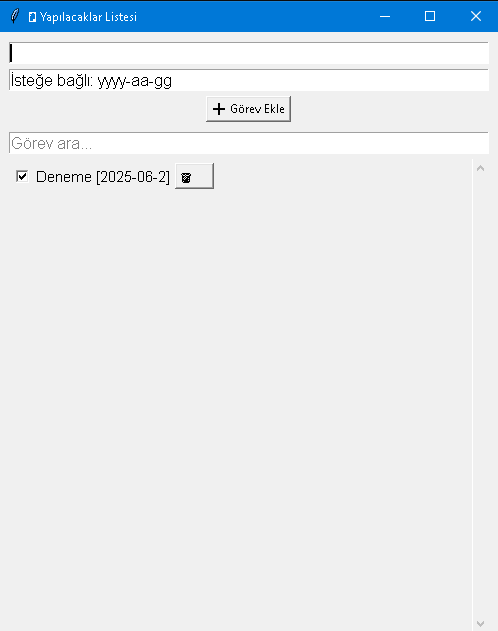

# 🗒️ Yapılacaklar Listesi (To-Do App)

Etkili ve sade bir yapılacaklar listesi uygulaması. Python ve Tkinter kullanılarak geliştirildi.  
Her görev için isteğe bağlı tarih ekleyebilir, görevleri işaretleyebilir, silebilir ve arayabilirsiniz.

## 🚀 Özellikler

- ✅ Görev ekleme ve tamamlama
- 🗑️ Görev silme
- 🔍 Arama / filtreleme
- 📅 İsteğe bağlı tarih ekleme (yyyy-aa-gg formatında)
- 💾 Otomatik olarak görevleri dosyaya kaydeder
- 🔄 Kapatıp açsanız bile görevleriniz saklanır

## 🖼️ Arayüz



## 📦 Gereksinimler

- Python 3.x
- Tkinter (Python ile birlikte gelir)

## 🛠️ Nasıl Çalıştırılır?

1. Bu projeyi indir veya klonla:

   ```bash
   git clone https://github.com/kullaniciadi/yapilacaklar-listesi.git
   cd yapilacaklar-listesi
